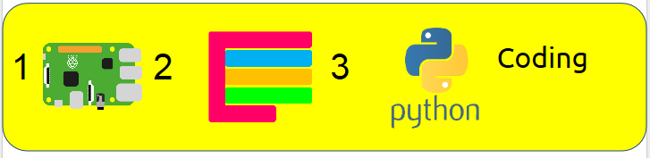
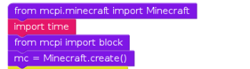
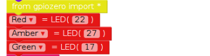
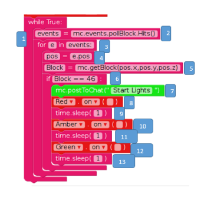

# 1, 2, 3 Coding: Minecraft: Switching on traffic lights.


## Why 1,2,3?

+This is the first example of 1, 2, 3 coding cards. EduBlocks enables you to simply create Python code in a drag and drop environment. In this first exercise we will use Python to send a message to the in game chat window. We will then create the exact same mod using Python 3 which is a text based programming language. 

Step 1: Grab a Pi.

Step 2: Master visual coding with EduBlocks.

Step 3: Learn how to create the same mod with text based code with Python 3.

## Installing EduBlocks
1. Click on terminal
2. Ensure that you have an internet connection and type in the following code

```bash
curl -sSL get.edublocks.org | bash
```
3. When promted by the installer, press enter to select YES to install.
4. The installer will now run for a few minutes. This depends on your internet speeds.
5. You will now be able to see EduBlocks in the Raspberry Pi >> Programming menu. Click on the EduBlocks link to run the program.
6. After around half a minute, you should be able to see the EduBlocks workspace.

## Getting started with the code

1. Open EduBlocks from the Desktop icon.
2. Click on the Minecraft coding tab on the left handside

## Digging into The EduBlocks code

3. Click on the Minecraft coding tab 
4. Drag in and drop the two libraries that you need to borrow code from, the blocks look like this:



5. Click on the INSERT NAME OF SUB TAB tab and drag in the next few blocks that look like this:



6. Save the code.
7. Open Minecraft.
8. Open a new world.
9. Press tab on the keyboard, click run and see your message on screen, like below:

## In action


## The EduBocks code


## The Python code
1. Click on the menu > programming > Python 3.
2. Click new file.
3. Type in the following code.
```
from mcpi.minecraft import Minecraft
import time
from mcpi import block
from gpiozero import *
mc = Minecraft.create()

Red = LED(22)
Amber = LED(27)
Green = LED(17)
while True:
  events=mc.events.pollBlockHits()
  for e in events:
    pos=e.pos
    Block=mc.getBlock(pos.x,pos.y,pos.z)
    if Block == 46:
      mc.postToChat("Start Lights")
      Red.on()
      time.sleep(1)
      Red.off()
      Amber.on()
      time.sleep(1)
      Amber.off()
      Green.on()
      time.sleep(1)
      Green.off()
```
4. Save the file.
5. Call it "Hello_Steve.py"
6. Open Minecraft by clicking menu > games > Minecraft. 
7. Click on create new world.
6. Minimise Minecraft and open idle again,then press f5 to run the code.
7. If you click back onto the Minecraft world your message should appear like below:

## In action

