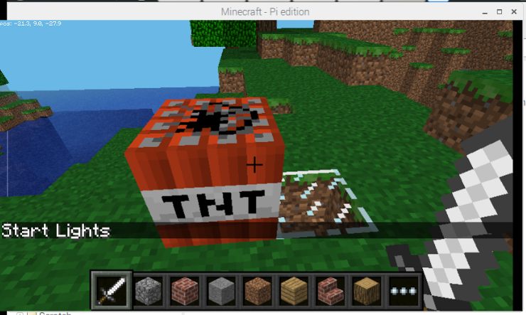

# 1, 2, 3 Coding: Minecraft: Switching on traffic lights.


## Why 1,2,3?

+This is the first example of 1, 2, 3 coding cards. EduBlocks enables you to simply create Python code in a drag and drop environment. In this first exercise we will use Python to send a message to the in game chat window. We will then create the exact same mod using Python 3 which is a text based programming language. 

Step 1: Grab a Pi.

Step 2: Master visual coding with EduBlocks.

Step 3: Learn how to create the same mod with text based code with Python 3.

## Installing EduBlocks
1. Click on terminal
2. Ensure that you have an internet connection and type in the following code

```bash
curl -sSL get.edublocks.org | bash
```
3. When promted by the installer, press enter to select YES to install.
4. The installer will now run for a few minutes. This depends on your internet speeds.
5. You will now be able to see EduBlocks in the Raspberry Pi >> Programming menu. Click on the EduBlocks link to run the program.
6. After around half a minute, you should be able to see the EduBlocks workspace.

## Connecting the Traffic lights
Connect your LEDs to the following pins:

| LED       | GPIO  |
| --------- | :------: |
| Red       | 22       |
| Amber     | 27       |
| Green     | 17       |

## Getting started with the code

1. Open EduBlocks from the Desktop icon.

2. Click on the Minecraft coding tab on the left handside of the EduBlocks interface.

## Digging into The EduBlocks code

3. Drag in and drop the two Minecraft libraries that you need to borrow code from, the blocks look like this:

4. Click on the INSERT NAME OF SUB TAB tab and drag in Minecraft.create() block


5. Congratulations!  you have now successfully connected your code to Minecraft. Next up we need to click on the Gpio Zero tab and then select the Output subtab. Firstly, we need to import the Gpiozero library code. 

6. Next up we can define three leds with names Red, Amber and Green and attach the pin list if the pin numbers(see above) that control each LED.


## Getting into the loop
This code block needs to be broken down and explained in turn to try and make sense of how it works. Here is the code:


1. You can drag in the while True: loop so that your program can permanently repeat.

2. From the basics menu you can find number two block and create a list that stores the most recent blocks that you have hit

3. Creates a loop

4. Picks up the current position of the block

5. Takes x, y, z positions of the current block

6. Asks the question if the block id is 46, TNT then carryout the next instruction 

7. Post message to chat8. Turn on the Red led to on

9. Wait for 1 second

10. Turn on the Amber led to on

11. Wait for 1 second

12. Turn on the Green led to on

13. Wait for 1 second

Nearly there well done for sticking with it, next up.....

14.You need to save the code as an xml file e.g. 'Traffic lights.XML'

15. Next up open Minecraft.

16. Then you need to open a new world.

17. In Minecraft world lay a TNT block. 

18. Next up, run the code from EduBlocks and switch back to Minecraft.

19. If you whack the TNT block, you should see lights turn on. Congratulations :) 

## In action


## The EduBocks code


## The Python code
1. Click on the menu > programming > Python 3.
2. Click new file.
3. Type in the following code.
```
from mcpi.minecraft import Minecraft
import time
from mcpi import block
from gpiozero import *
mc = Minecraft.create()

Red = LED(22)
Amber = LED(27)
Green = LED(17)
while True:
  events=mc.events.pollBlockHits()
  for e in events:
    pos=e.pos
    Block=mc.getBlock(pos.x,pos.y,pos.z)
    if Block == 46:
      mc.postToChat("Start Lights")
      Red.on()
      time.sleep(1)
      Red.off()
      Amber.on()
      time.sleep(1)
      Amber.off()
      Green.on()
      time.sleep(1)
      Green.off()
```
4. Save the file.
5. Call it "Hello_Steve.py"
6. Open Minecraft by clicking menu > games > Minecraft. 
7. Click on create new world.
6. Minimise Minecraft and open idle again,then press f5 to run the code.
7. If you click back onto the Minecraft world your message should appear like below:

## In action

